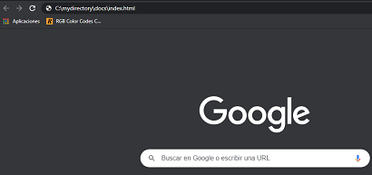
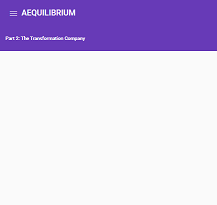
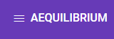
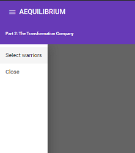
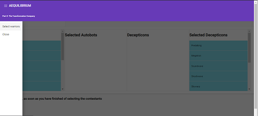
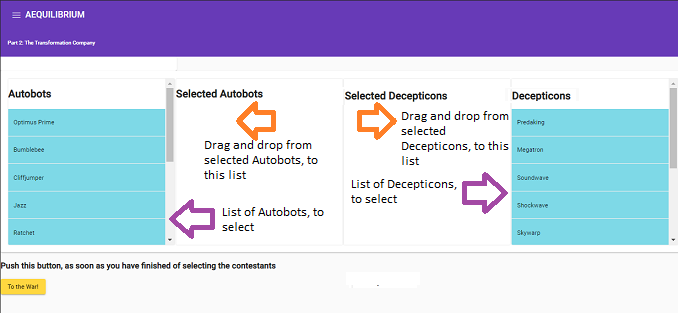
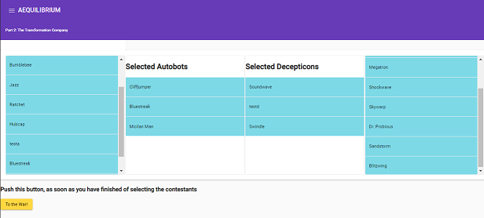
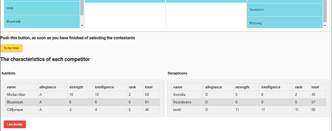
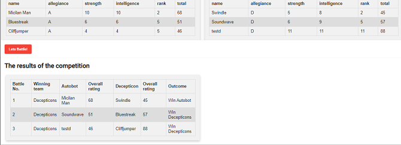

**Part 2: The Transformation Company**

**Background**

Aequilibrium does love transforming… people, lives, teams, companies. And there’s no better representation of transformation than Hasbro’s Transformers, the classic television series featuring heroic Autobots raging their battle to destroy the evil forces of the Deceptions.

**Problem layout**

The Transformers are at war and you are in charge of settling the score! For this part of the assignment please build a web application that evaluates who wins a fight between the Autobots and the Decepticons. You have the option to use any modern web framework. The input data can be static, there is no need to persist any data or provide any back-end services. However, we will be testing the solution against multiple use cases besides the basic example. Please include instructions on how to run and use your solution.

**Rules of a battle**

- The teams should be sorted by rank and faced off one on one against each other in order to determine a victor, the loser is eliminated
- A battle between opponents uses the following rules:
  - If any fighter is down 4 or more points of courage and 3 or more points of strength compared to their opponent, the opponent automatically wins the face-off regardless of overall rating (opponent has run away)
  - Otherwise, if one of the fighters is 3 or more points of skill above their opponent, they win the fight regardless of the overall rating
  - The winner is the Transformer with the highest overall rating
- In the event of a tie, both Transformers are considered destroyed
- Any Transformers who don’t have a fight are skipped (i.e. if it’s a team of 2 vs. a team of 1, there’s only going to be one battle)
- The team who eliminated the largest number of the opposing team is the winner

**Special rules**

- Any Transformer named Optimus Prime or Predaking wins his fight automatically regardless of any other criteria
- In the event, either of the above face each other, or a duplicate of each other, the game immediately ends with all competitors destroyed

**Project Structure**

Was developed as an Angular application, using Angular Material, for embellishment. so that it will run smoothly.

**Assumptions**

I use to array with the corresponding data for each team. Are located in the directory src/app/components/selectwarriors.

- Autobots – data-autobots.ts
- Decepticons – data-decepticons.ts

**Execution**

To run the sample, 

1. Create a directory, for downloading the application, in your machine
1. You should have to download the contents of the dist directory(src/app/docs), of the project in the selected directory.
1. Paste in a navigator (Chrome, IE, Safari, etc.) URL,  the path where is located the “index.html” file (fully), including the “index.html”. ie. C:\mydirectory\docs\index.html.

1. Refresh the navigator.
1. Will show a screen like this: 

1. In the left upper part there is an image of three horizontal lines.

1. Press these lines, after, will appear like this.

1. Choose and press “Select warriors”
1. Will appear a new screen inside the big area, like this:

1. Just press any place inside the big area, and the left menu, will disappear.

1. Drag and drop from the corresponding list of transformers to the next list, your selected choice. See below image, as an example.

1. In order to see the contestants, you have to press the yellow button “To the War!”, as it appears:

1. You are ready for the contest. press the red button “Lets Battle!”, Then will show you the result.

